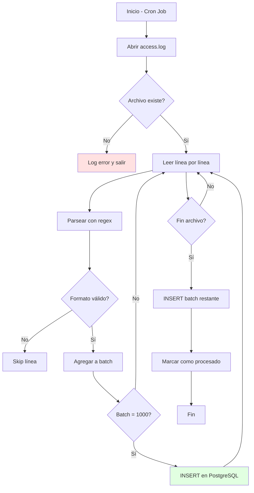

## Responsabilidad
Leer archivos de log del servidor web, parsearlos y cargarlos en PostgreSQL.

## Diagrama de Flujo


## Código Principal
```python
# etl_processor.py
import re
from datetime import datetime
import psycopg2

class LogProcessor:
    """
    Procesa logs de Apache/Nginx y los carga en PostgreSQL.
    
    Attributes:
        conn: Conexión a PostgreSQL
        batch_size: Tamaño del lote para inserts (default: 1000)
    """
    
    def __init__(self, db_config, batch_size=1000):
        self.conn = psycopg2.connect(**db_config)
        self.batch_size = batch_size
        self.cursor = self.conn.cursor()
    
    def parse_log_line(self, line):
        """
        Parsea una línea de log en formato Apache Combined.
        
        Args:
            line (str): Línea del archivo de log
            
        Returns:
            dict: Datos estructurados o None si el formato es inválido
            
        Example:
            >>> line = '192.168.1.1 - - [10/Jan/2026:14:23:45 +0000] "GET /home HTTP/1.1" 200 4523'
            >>> result = processor.parse_log_line(line)
            >>> print(result['ip'])
            '192.168.1.1'
        """
        # Patrón regex para Apache Combined Log Format
        pattern = r'(\S+) \S+ \S+ \[(.*?)\] "(\S+) (\S+) \S+" (\d+) (\d+)'
        match = re.match(pattern, line)
        
        if not match:
            return None
            
        return {
            'ip': match.group(1),
            'timestamp': datetime.strptime(match.group(2), '%d/%b/%Y:%H:%M:%S %z'),
            'method': match.group(3),
            'url': match.group(4),
            'status': int(match.group(5)),
            'bytes': int(match.group(6))
        }
```

## Configuración

### Archivo `.env`
```bash
DB_HOST=localhost
DB_PORT=5432
DB_NAME=traffic_analytics
DB_USER=postgres
DB_PASSWORD=tu_password_aqui
LOG_FILE_PATH=/var/log/apache2/access.log
```

### Cron Job
```bash
# Ejecutar cada hora
0 * * * * cd /home/user/proyecto && python3 etl_processor.py >> logs/etl.log 2>&1
```

## Testing
```python
# test_log_processor.py
import unittest

class TestLogProcessor(unittest.TestCase):
    def test_parse_valid_line(self):
        line = '192.168.1.1 - - [10/Jan/2026:14:23:45 +0000] "GET /home HTTP/1.1" 200 4523'
        result = processor.parse_log_line(line)
        
        self.assertEqual(result['ip'], '192.168.1.1')
        self.assertEqual(result['method'], 'GET')
        self.assertEqual(result['status'], 200)
    
    def test_parse_invalid_line(self):
        line = 'invalid log line'
        result = processor.parse_log_line(line)
        
        self.assertIsNone(result)
```

## Troubleshooting

| Problema | Solución |
|----------|----------|
| Error de conexión a BD | Verificar credenciales en `.env` |
| Regex no matchea | Verificar formato del log (Apache vs Nginx) |
| Insert lento | Aumentar `batch_size` a 5000 |
| Memoria insuficiente | Reducir `batch_size` a 500 |

## Links Relacionados
- [[Conexion-BD|Configuración de PostgreSQL]]
- [[Base-de-Datos|Estructura de tablas]]
- Volver a [[README]]